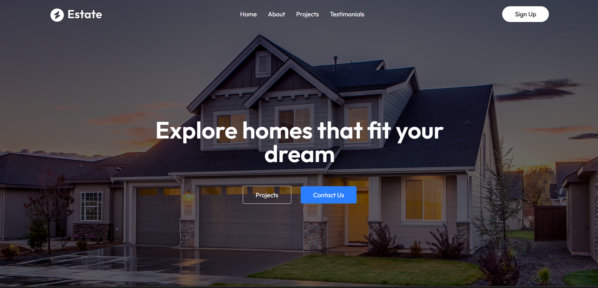
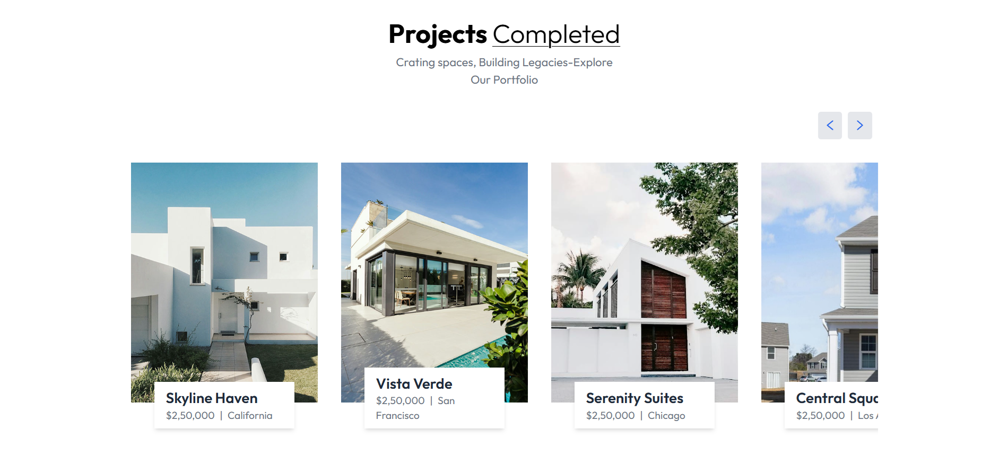
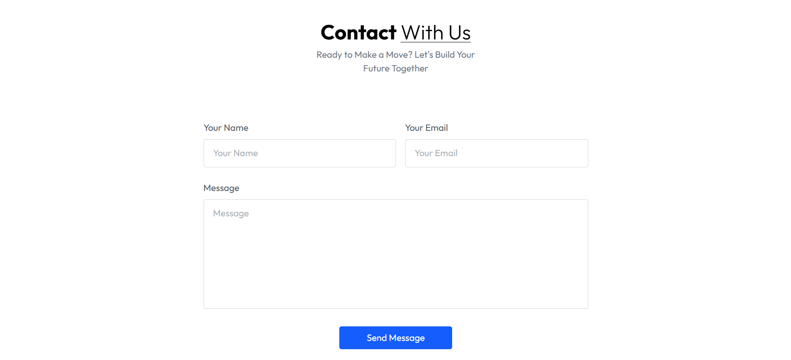

# 🏡 Estate Website

A modern, responsive real estate website built with **React**, **Vite**, and **Tailwind CSS**. This project serves as a sleek and performant starting point for building full-stack real estate platforms or showcasing property listings.

---

## 🚀 Features

* ⚡️ **Fast Development**: Powered by Vite for rapid build and hot module replacement (HMR)
* 🎨 **Beautiful UI**: Styled with Tailwind CSS for a clean and responsive design
* ✨ **Smooth Animations**: Integrated with Framer Motion for interactive user experience
* 📱 **Responsive Design**: Works seamlessly on mobile, tablet, and desktop devices
* 🛠 **Code Quality**: ESLint configured for consistent and error-free code

---

## 📂 Tech Stack

* **Frontend**: React, Vite, Tailwind CSS
* **Animations**: Framer Motion
* **Linting**: ESLint
* **Build Tool**: Vite

---

## 📸 Preview

### 🏠 Homepage


### 🏘 Property Listings


### 📞 Contact Page



---

## 🚧 Getting Started

Follow these steps to set up the project locally:

### 1️⃣ Clone the repository

```bash
git clone https://github.com/yourusername/estate-website.git
cd estate-website
```

### 2️⃣ Install dependencies

```bash
npm install
```

### 3️⃣ Run the development server

```bash
npm run dev
```

Open your browser at `http://localhost:5173` to see the app running.

### 4️⃣ Build for production

```bash
npm run build
```

### 5️⃣ Preview production build

```bash
npm run preview
```

---

## 📜 .gitignore

This project uses a `.gitignore` file to exclude files like `node_modules`, `dist`, and log files from version control.

---

## 📣 Acknowledgements

* [React](https://react.dev/)
* [Vite](https://vitejs.dev/)
* [Tailwind CSS](https://tailwindcss.com/)
* [Framer Motion](https://www.framer.com/motion/)
* [React Toastify](https://fkhadra.github.io/react-toastify/)
